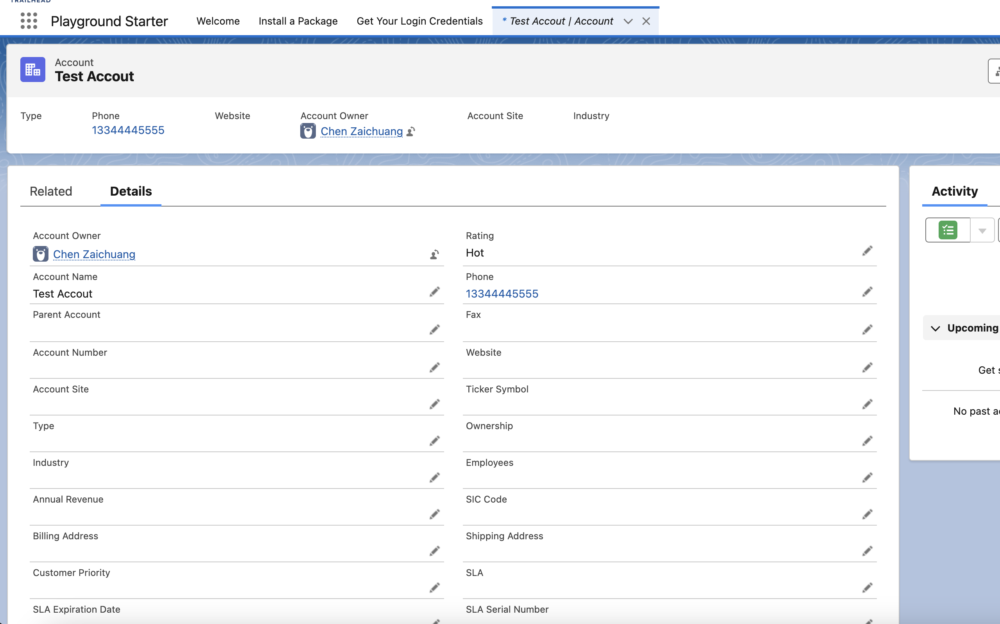
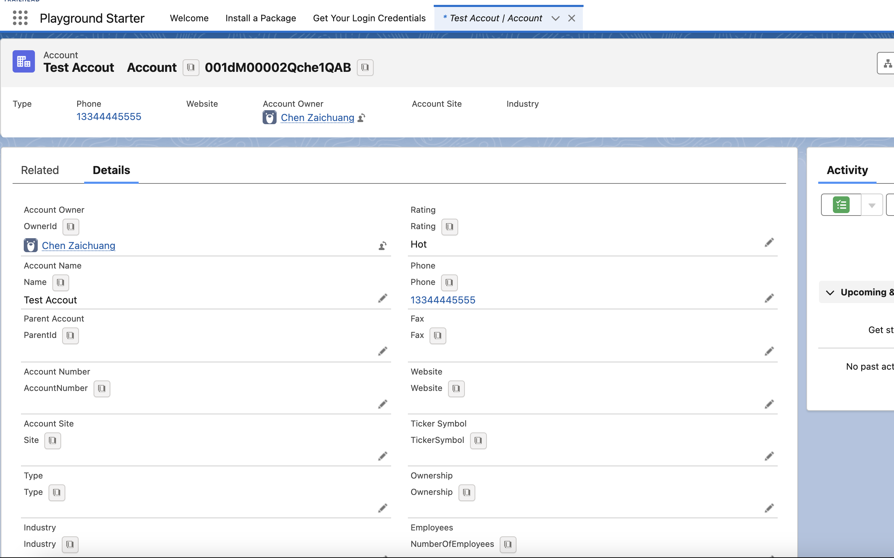

# Salesforce Show API Name

A Chrome extension that displays field and object API names on Salesforce record pages with enhanced copy functionality.

## Features

- Shows API names for both fields and objects on record detail pages
- Works in both Salesforce Classic and Lightning Experience
- Advanced copy functionality:
    - **Click**: Copy single API name
    - **Cmd/Ctrl+Click**: Multi-select fields (comma-separated)
    - **Shift+Cmd/Ctrl+Click**: Generate SOQL query with selected fields
- Visual feedback for selected/copied fields
- Keyboard shortcuts for quick toggling

## Installation

1. Install from the [Chrome Web Store](https://chrome.google.com/webstore/detail/salesforce-api-name-helper/EXTENSION_ID_HERE)
    - Search for "Salesforce API Name Helper"
    - Look for the icon 

2. Alternatively, you can [load the unpacked extension](https://developer.chrome.com/docs/extensions/mv3/getstarted/development-basics/#load-unpacked) in developer mode

## Usage

### Basic Usage
1. Navigate to any Salesforce record detail page (Classic or Lightning)
2. Click the extension icon  to show/hide API names
    - Before: 
    - After: 

### Advanced Copy Features
| Action | Behavior |
|--------|----------|
| Click | Copies single API name |
| Cmd/Ctrl+Click | Multi-select fields (copied as comma-separated list) |
| Shift+Cmd/Ctrl+Click | Generates SOQL query with selected fields |

### Keyboard Shortcuts
| OS | Shortcut | Action |
|----|----------|--------|
| macOS | Control + Command + Z | Toggle API names |
| Windows/Linux/ChromeOS | Alt + Shift + Z | Toggle API names |

## Feedback & Support

We welcome your feedback and contributions!

- 🐛 Report issues or bugs: [GitHub Issues](https://github.com/your-repo/issues)
- 💡 Feature requests: Open a GitHub issue
- ✉️ Email: 1158400735@qq.com
- ⭐ Leave a review on the Chrome Web Store

## Changelog

### v2.0.0 (Current)
- Advanced copy functionality

## Development

To contribute or modify the extension:

1. Clone this repository
2. Load as unpacked extension in Chrome
3. Make your changes
4. Submit a pull request  