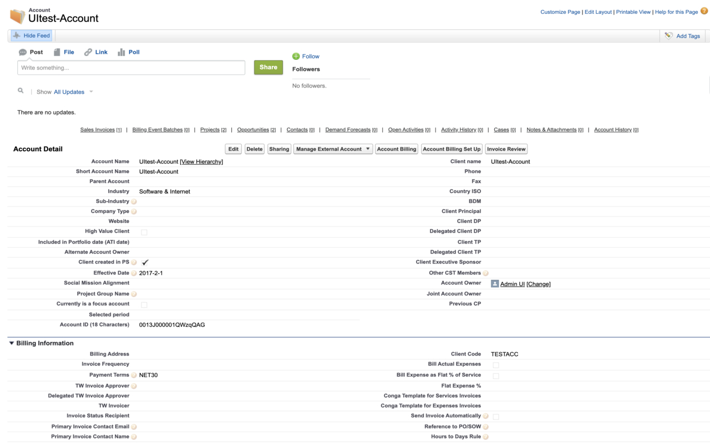
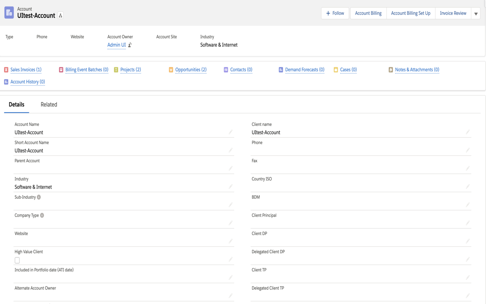
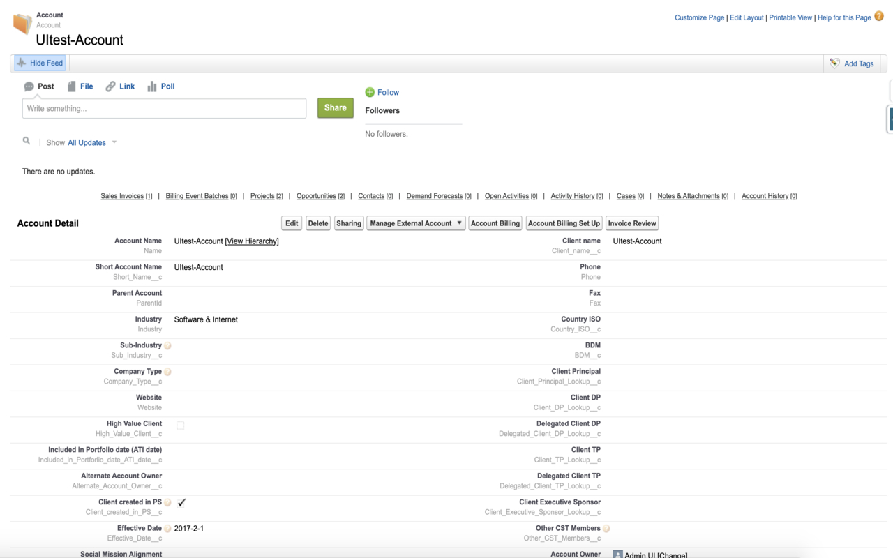
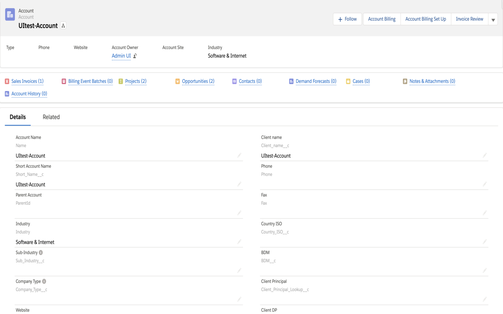

# salesforce_show_api_name
This repo is a chrome extension to show field and object api name on record detail page

#### How to use it

1. Go to [google web store](https://chrome.google.com/webstore/category/extensions) and search 'salesforce show api name', you'll see result with icon , then you can install it.

2. In salesforce classic/lightning record detail page, such as the page below:  or , 
    click extension icon , you will see the field/object api name added to the page, 
    such as the page below:  or 

3. In addition to clicking the icon, shortcut is supported:

|  OS   | Shortcut  |
|  :----:  | :----:  |
| MacOs  | control + command + Z |
| Windows  | control + shift + Z |
| Linux  | control + shift + Z |
| ChromeOs  | control + shift + Z |

#### Feedback
I appreciate to receive any feedbacks or pull requests, you can leave your comments in this repo or in the extension homepage or mail to 1158400735@qq.com with any suggestions.

